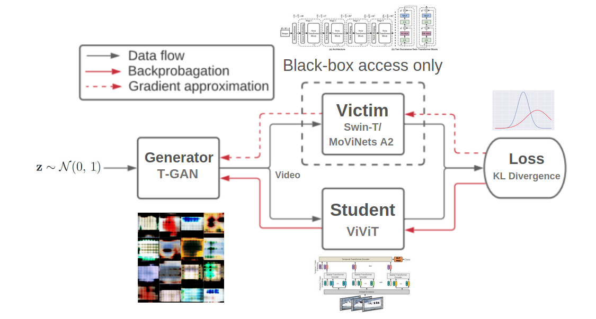

# Model Extraction Attacks Video Classification

## End to End Approach



## Installation

```bash
$ pip install vidmodex ## Stable version
$ pip install git+https://github.com/hex-plex/Model-Extraction-Attacks-Video-Classification ## Latest development
```

## Usage
Simple snippet explaining the usage

### BlackBox Extraction
```python
# Black Box Victim: SwinT, Student: ViViT, Generator: Tgan

from vidmodex.models import ViViT as Student
from vidmodex.models import SwinT as Victim
from vidmodex.generator import Tgan as Generator

custom_config = {}
custom_config["num_classes"] = 400

blackbox_main(custom_config)
```
### GreyBox Extraction

```python
# Grey Box Victim: SwinT, Student: ViViT, Generator: Tgan, Dataset: Kinetics 400

from vidmodex.models import ViViT as Student
from vidmodex.models import SwinT as Victim
from vidmodex.generator import Tgan as Generator

custom_config = {}
custom_config["csv_file"] = "ENTER-THE-LOCATION-OF-DATA-CSV"
custom_config["root_dir"] = "ENTER-THE-LOCATION-OF-DATA-ROOT"
custom_config["ucf_gan_weights"] = "ENTER-THE-LOCATION-OF-UCF-WEIGHTS" or "state_normal81000.ckpt"
custom_config["num_classes"] = 400

greybox_main(custom_config)
```

## File Structure

This is for reference if one wants to experiment his own model or algorithm he may change that specific module / part

```
models/
 - modela.py           ## Video Classification Architecture (Teacher/Student)
 - modelb.py
train/
 - train_loop1.py      ## Traing Algorithm
 - train_loop2.py
generator/
 - generator1_.py      ## Video Generator Architecture
 - generator2_.py

main_file.py           ## Contains your custom config/data
..
```

## References

[[1]](#1) **ViViT: A Video Vision Transformer** [https://arxiv.org/abs/2103.15691] [cs.CV] 1 Nov 2021

[[2]](#2) **MoViNets: Mobile Video Networks for Efficient Video Recognition** [https://arxiv.org/abs/2103.11511] [cs.CV] 18 Apr 2021

[[3]](#3) **Swin Transformer: Hierarchical Vision Transformer using Shifted Windows** [https://arxiv.org/abs/2103.14030] [cs.CV] 17 Aug 2021

[[4]](#4) **Temporal Generative Adversarial Nets with Singular Value Clipping** [https://arxiv.org/abs/1611.06624] [cs.LG] 18 Aug 2017

[[5]](#5) **Data-Free Model Extraction** [https://arxiv.org/abs/2011.14779] [cs.LG] 31 Mar 2021

[[6]](#6) **MAZE: Data-Free Model Stealing Attack Using Zeroth-Order Gradient Estimation** [https://arxiv.org/abs/2005.03161] [stat.ML] 6 May 2020

[[7]](#7) **Robustness and Diversity Seeking Data-Free Knowledge Distillation** [https://arxiv.org/abs/2011.03749] [cs.LG] 10 Feb 2021 
